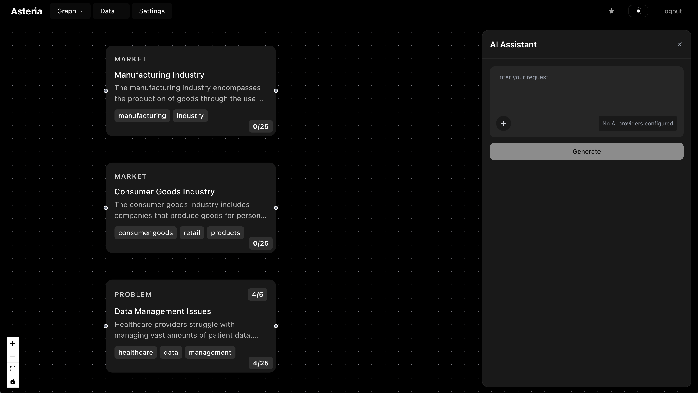

<div align="center">


<h1>Asteria</h1>

*Asteria - AI-Powered Mind Mapping for Startup Ideation*


---

</div>

An AI-powered mind-mapping application for startup ideas and business concepts. Create interconnected graphs of problems, solutions, markets, technologies, and themes with intelligent content generation and relationship suggestions.

## Features

- **Interactive Graph Canvas**: Visual node-edge graph powered by React Flow
- **AI-Assisted Content**: Generate ideas, expand concepts, and suggest connections
- **Smart Node Types**: Problems, solutions, markets, technologies, themes, and notes
- **Relationship Mapping**: Multiple edge types (solves, depends_on, competes_with, related, enables, contradicts)
- **Node Scoring System**: Rate ideas on pain killer, founder fit, timing, moat, and practicality (1-5 scale)
- **Tag Management**: Organize and categorize nodes with flexible tagging
- **Multi-tenant Workspaces**: Isolated spaces for different projects or teams
- **Real-time Collaboration**: Built on Supabase with live updates

## Tech Stack

### Frontend
- **Next.js 15** with App Router and React 19
- **TypeScript** for type safety
- **TailwindCSS 4** with shadcn/ui components
- **React Flow** for graph visualization
- **Zustand** for state management
- **TanStack Query** for data fetching and caching

### Backend
- **Supabase** (PostgreSQL database with auth)
- **Prisma ORM** for database operations
- **Zod** for runtime validation
- **pnpm** package management

## Getting Started

### Prerequisites

- Node.js 18+ and pnpm
- Supabase account and project

### Installation

1. **Clone the repository**
   ```bash
   git clone <repository-url>
   cd Asteria
   ```

2. **Install dependencies**
   ```bash
   pnpm install
   cd web && pnpm install
   ```

3. **Set up environment variables**
   
   Copy the example file and configure:
   ```bash
   cd web
   cp .env.local.example .env.local
   ```
   
   Required variables:
   ```bash
   NEXT_PUBLIC_SUPABASE_URL=your_supabase_project_url
   NEXT_PUBLIC_SUPABASE_ANON_KEY=your_supabase_anon_key
   DATABASE_URL=postgresql://...
   DIRECT_URL=postgresql://...
   
   # Future AI integration
   AI_PROVIDER=openai
   OPENAI_API_KEY=your_openai_api_key
   ANTHROPIC_API_KEY=your_anthropic_api_key
   RAG_ENABLED=false
   ```

4. **Set up the database**
   ```bash
   # Generate Prisma client
   npx prisma generate
   
   # Run database migrations
   npx prisma migrate dev
   
   # (Optional) Open Prisma Studio to explore data
   npx prisma studio
   ```

5. **Start the development server**
   ```bash
   cd web
   pnpm dev
   ```

   The application will be available at `http://localhost:3000`

## Development Commands

### Frontend (web directory)
```bash
cd web
pnpm dev          # Start development server with Turbopack
pnpm build        # Build for production
pnpm start        # Start production server
pnpm lint         # Run ESLint
```

### Database
```bash
npx prisma migrate dev    # Create and apply new migration
npx prisma generate      # Regenerate Prisma client
npx prisma studio        # Open Prisma Studio
npx prisma db push       # Push schema changes without migration
```

## Project Structure

```
/
├── web/                           # Next.js frontend application
│   ├── src/
│   │   ├── app/                   # Next.js App Router pages
│   │   │   ├── (dashboard)/graph/ # Main graph canvas page
│   │   │   └── api/               # API routes
│   │   ├── components/            # React components
│   │   │   ├── GraphCanvas.tsx    # Main React Flow component
│   │   │   ├── NodeEditPanel.tsx  # Node editing sidebar
│   │   │   ├── nodes/             # Custom node components
│   │   │   ├── edges/             # Custom edge components
│   │   │   └── ui/                # shadcn/ui components
│   │   ├── lib/                   # Utilities and core logic
│   │   │   ├── schemas.ts         # Zod validation schemas
│   │   │   ├── supabase.ts        # Supabase client setup
│   │   │   └── database.types.ts  # Generated types
│   │   └── hooks/                 # Custom React hooks
├── prisma/                        # Database schema and migrations
│   └── schema.prisma             # Prisma schema definition
├── generated/prisma/             # Generated Prisma client
└── package.json                  # Root package dependencies
```

## Database Schema

### Core Models

- **User**: Authentication and workspace ownership
- **Space**: Multi-tenant workspaces containing graphs
- **Node**: Graph nodes with types (problem, solution, market, tech, theme, note)
- **Edge**: Relationships between nodes (solves, depends_on, competes_with, related, enables, contradicts)
- **Tag**: Flexible categorization system
- **Snippet**: Future feature for web clipping and research

### Node Scoring

Each node supports optional 1-5 scoring across dimensions:
- **Pain Killer**: How well it addresses pain points
- **Founder Fit**: Alignment with founder strengths
- **Timing**: Market timing assessment
- **Moat**: Competitive advantage potential
- **Practicality**: Implementation feasibility

## Key Components

### GraphCanvas.tsx
Main React Flow integration with:
- Custom node type: `ideaNode` (IdeaNodeCard component)
- Custom edge type: `relationEdge` (RelationEdge component)
- Keyboard shortcuts: "N" key to create nodes
- Double-click canvas to add nodes

### NodeEditPanel.tsx
Sliding panel for editing:
- Node properties (title, type, description)
- Tag management with autocomplete
- Scoring inputs with validation
- Bulk parent assignment

### Schemas (lib/schemas.ts)
Zod validation for:
- Node and edge data structures
- AI-generated content drafts
- Enum definitions for types and relations

## Keyboard Shortcuts

- **N**: Create new node at cursor position
- **Double-click**: Add node on empty canvas area
- **Select multiple nodes**: Bulk edit operations

## Planned Features

- AI-powered content generation and suggestions
- Automatic relationship discovery
- Content clustering and summarization
- Web research integration with snippet collection
- Export capabilities (JSON, Obsidian markdown)
- Enhanced collaboration features

## Contributing

1. Fork the repository
2. Create a feature branch (`git checkout -b feature/amazing-feature`)
3. Commit your changes (`git commit -m 'Add some amazing feature'`)
4. Push to the branch (`git push origin feature/amazing-feature`)
5. Open a Pull Request

## License

This project is licensed under the ISC License.

## Support

For issues and questions:
- Create an issue in the GitHub repository
- Check existing documentation in CLAUDE.md for development guidance